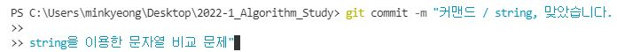

# 👊2022 1학기 영과일 자료구조 스터디👊

## 커리큘럼
* week1: C++ STL
* week2: 스택 & 큐

 

## 커밋 방법
1. "문제이름 / 문제분류, 정답여부" 형식을 제목으로 해주세요.
2. 한 줄 비우고 간단하게 문제 접근 방식을 적어주세요.
> 

 
  
## PR 방법
1. 매주 BOJ 그룹 문제집에 있는 문제를 풀고 해당 문제 번호 폴더에 {자신의 백준 닉네임}.cpp로 파일을 만들어 주세요.
2. 문제번호 / 접근 방식 / 느낀 난이도 를 포함하여 간단하게 PR 메시지를 작성하고 PR을 보내주세요!